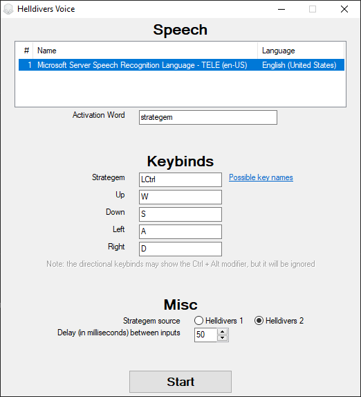

Helldivers Voice is an AutoHotKey script for activating Helldivers strategems via speech macro. This is powered by Microsoft Speech Platform through [evilC/HotVoice](https://github.com/evilC/HotVoice/).

Helldivers 2 support is provisionary as it is not fully tested and some strategems are still missing.

# Installation
1. Get this repository
    * Download and extract [master.zip](https://github.com/Wupb/HellDivers-Voice/archive/refs/heads/master.zip)  
    or
    * `git clone https://github.com/Wupb/HellDivers-Voice.git`
2. Download [HotVoice](https://github.com/evilC/HotVoice/releases) and copy its content to the script folder
3. Install [AutoHotKey_L](https://www.autohotkey.com/download/)
    * Alternatively, download the [executables](https://www.autohotkey.com/download/ahk.zip), rename `AutoHotkeyU64.exe` to `HellDivers Voice.exe` [†](https://www.autohotkey.com/docs/Program.htm#portability), and copy the executable to the script folder
4. Install [Microsoft Speech Platform Runtime](https://www.microsoft.com/en-us/download/details.aspx?id=27225). Install both the x86 and x64 version if unsure which to get.
5. Install a Speech Recognition [Runtime Language](https://www.microsoft.com/en-us/download/details.aspx?id=27224) (MSSpeech_SR_*.msi)

The [compiled releases](https://github.com/Wupb/HellDivers-Voice/releases) are also available, however, they still require Microsoft Speech Platform (step 4 & 5).

# Usage
1. (Optional) Edit `strategems.json` to change each strategem's alias, i.e. the spoken words
2. Run `HellDivers Voice.ahk` (if .ahk file association is set) or `HellDivers Voice.exe` (if the AHK executable was renamed)
3. Set configurations in the initial window, then start
4. Activate strategems by speaking the activation word, followed by a strategem's alias. For example:
> strategem dum-dum
5. Stop the script via the tray icon

# Remarks
* A tooltip will appear whenever a speech is recognized, however, the inputs will only be send if the game is in focus.
* Holding down keys sometimes interfere with the macros, so it is best to stand still when activating strategems.
* The speech platform sometimes has trouble listening for abbreviations, especially ones starting with M. Several abbreviation are space-separated to distinctly separate each spoken alphabet.